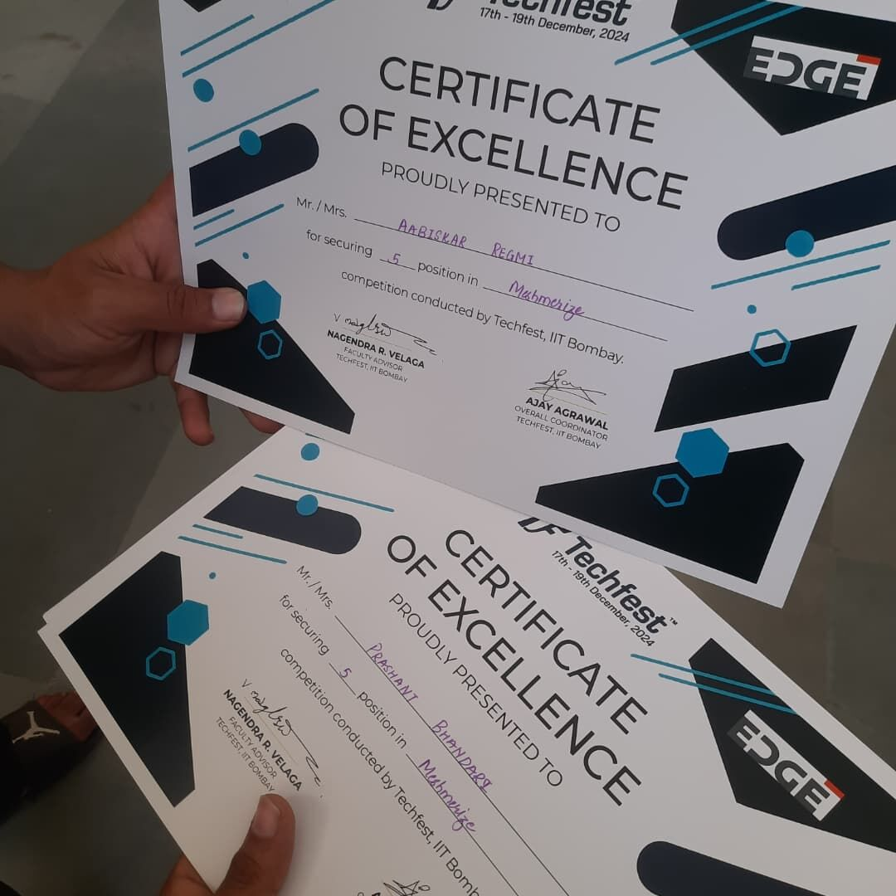
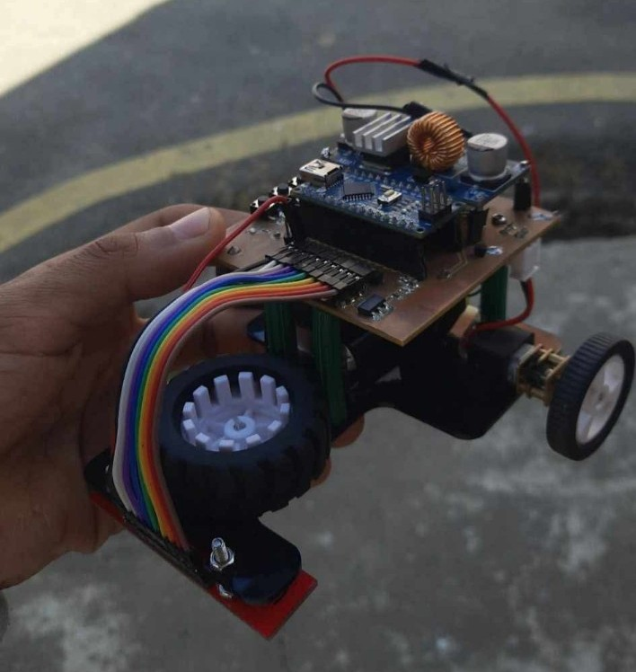
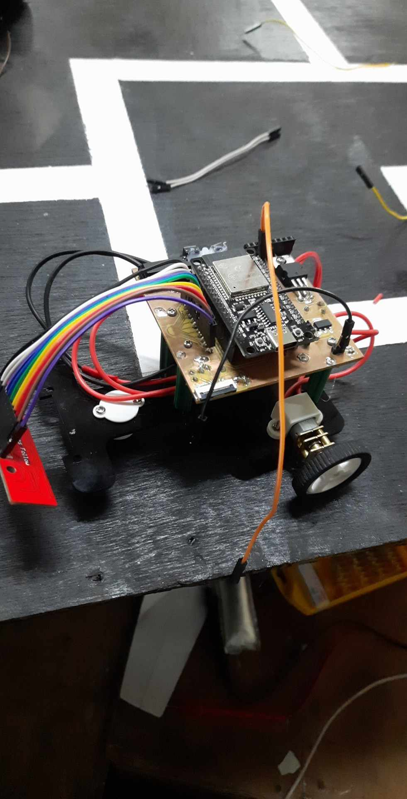
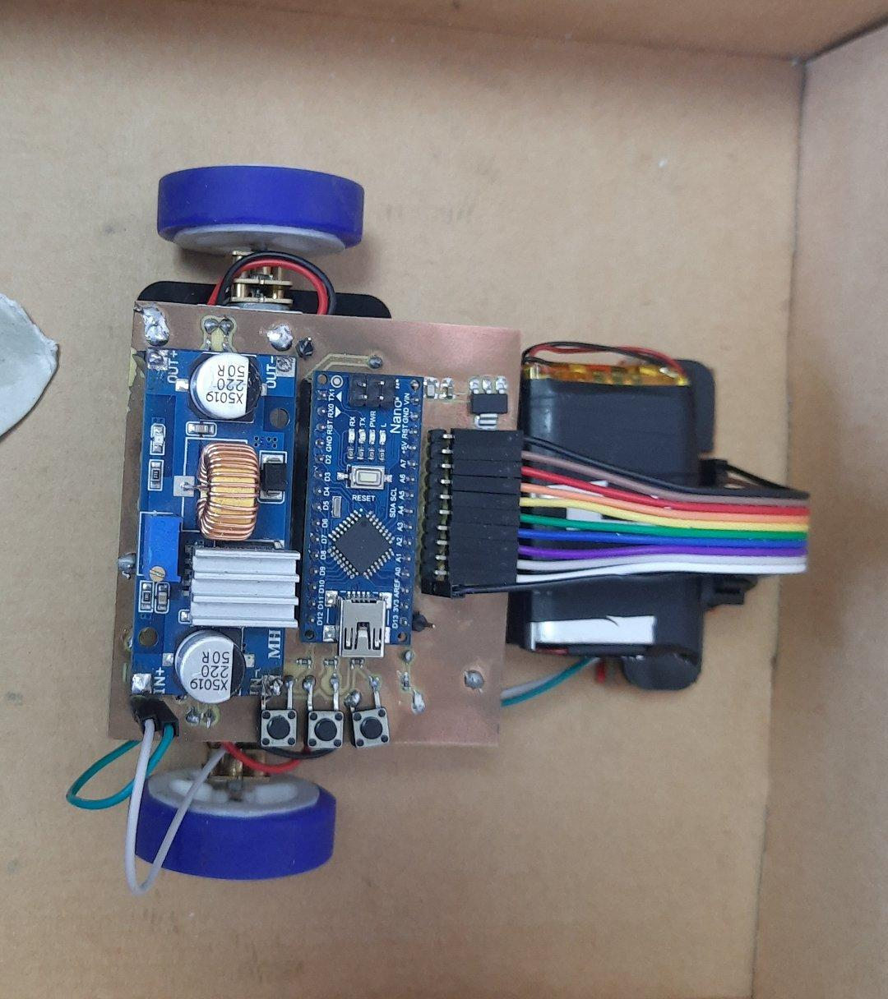

# 🤖 Meshmerize MicroMouse Project

[](https://opensource.org/licenses/MIT)
[](https://github.com/prashantbhandary/Meshmerize-MicroMouse-)
[](https://www.kicad.org/)

> **A comprehensive autonomous line-following and maze-solving robot project featuring multiple hardware iterations, advanced algorithms, and professional PCB designs.**

## 🏆 Competition Achievements

Our MicroMouse has proven its excellence in prestigious robotics competitions:

- 🥇 **1st Place** - Locus, Pulchowk Campus  
- 🥈 **2nd Place** - Delta 5.0, Dharan IOE  
- 🏅 **5th Place** - Techfest, IIT Bombay 2024

<div align="center">


*Certificate of Achievement from IIT Bombay Techfest 2024*

</div>

---

## 📋 Table of Contents

- [🎯 Project Overview](#-project-overview)
- [✨ Key Features](#-key-features)
- [🔧 Hardware Versions](#-hardware-versions)
- [💻 Software Architecture](#-software-architecture)
- [🚀 Getting Started](#-getting-started)
- [📁 Repository Structure](#-repository-structure)
- [🛠️ Installation & Setup](#️-installation--setup)
- [🎮 Usage Instructions](#-usage-instructions)
- [🧠 Algorithms & Control Systems](#-algorithms--control-systems)
- [📷 Project Gallery](#-project-gallery)
- [🤝 Contributing](#-contributing)
- [📄 License](#-license)

---

## 🎯 Project Overview

The **Meshmerize MicroMouse** is an autonomous robot designed to navigate line-following courses and solve complex mazes. This project showcases the evolution of robotics engineering through multiple hardware iterations, from Arduino Nano-based prototypes to advanced ESP32-powered systems.

### What Makes This Project Special?

- **Multiple Hardware Generations**: Evolution from v1.0 to v3.1 with continuous improvements
- **Dual Platform Support**: Both Arduino Nano and ESP32 implementations
- **Professional PCB Design**: Custom-designed circuit boards using KiCad
- **Advanced Algorithms**: LSRB maze-solving with optimized PID control
- **Competition-Tested**: Proven performance in national and international competitions

---

## ✨ Key Features

### 🎯 **Navigation Capabilities**
- **Line Following**: Precise black/white line detection and following
- **Maze Solving**: Autonomous exploration and shortest path execution
- **Multi-Surface Support**: Adaptable to different track conditions

### ⚡ **Performance Optimization**
- **PID Control System**: Smooth and accurate movement control
- **Speed Management**: Adaptive speed control for different track sections
- **Sensor Calibration**: Advanced sensor tuning for reliable detection

### 🔧 **Hardware Excellence**
- **Custom PCB Design**: Professional circuit board layouts
- **Modular Architecture**: Easy maintenance and upgrades
- **Power Management**: Efficient voltage regulation for all components

---

## 🔧 Hardware Versions

<details>
<summary><strong>Arduino Nano Series</strong></summary>

### Version 1.0 - Prototype
- **Microcontroller**: Arduino Nano
- **Motor Driver**: L293D
- **Sensors**: QTR-8A analog sensor array
- **Status**: Initial prototype and testing phase

### Version 2.0 - Enhanced Performance
- **Microcontroller**: Arduino Nano (optimized)
- **Motor Driver**: SparkFun TB6612FNG
- **Sensors**: 8-channel QTR sensor array
- **Improvements**: Better motor control, enhanced PID tuning
- **PCB**: Custom-designed v2.0 PCB

### Version 3.0/3.1 - Professional Grade
- **Microcontroller**: Arduino Nano
- **Features**: Professional PCB design with improved layout
- **Status**: Competition-ready version

</details>

<details>
<summary><strong>ESP32 Series</strong></summary>

### ESP32 Version 1.0
- **Microcontroller**: ESP32 DevKit
- **Development**: PlatformIO-based development
- **Features**: 
  - Wireless capabilities
  - Higher processing power
  - Advanced sensor integration
- **PCB**: Custom ESP32-based PCB design

</details>

---

## 💻 Software Architecture

### Programming Platforms
- **Arduino IDE**: Traditional Arduino Nano development
- **PlatformIO**: Advanced ESP32 development with better library management

### Key Libraries
```cpp
#include <SparkFun_TB6612.h>  // Motor control library
#include <QTRSensors.h>       // Sensor array library
```

### Algorithm Implementation
- **LSRB Algorithm**: Left-Straight-Right-Back priority maze solving
- **PID Control**: Proportional-Integral-Derivative control for smooth movement
- **Path Optimization**: Shortest path calculation and execution

---

## 🚀 Getting Started

### Prerequisites
- Arduino IDE or PlatformIO
- USB cable for programming
- Basic electronics knowledge
- Robotics track or maze for testing

### Quick Setup
1. **Clone the repository**
   ```bash
   git clone https://github.com/prashantbhandary/Meshmerize-MicroMouse-.git
   cd Meshmerize-MicroMouse-
   ```

2. **Choose your platform**
   - For Arduino Nano: Navigate to `ArduinoNano/` folder
   - For ESP32: Navigate to `Esp32/` folder

3. **Select the appropriate version**
   - Pick the version that matches your hardware setup
   - Latest versions recommended for best performance

---

## 📁 Repository Structure

```
📦 Meshmerize-MicroMouse-
├── 🔧 ArduinoNano/
│   ├── 🧪 arduno_nano_v1_TestingCode/
│   │   ├── arduino_sensor_test2.0/
│   │   ├── black_line_maze_2.0/
│   │   ├── motor-testing/
│   │   └── night_nano/
│   ├── 📋 micro_mouse_v1-files/
│   │   ├── codes/ (Line follower, maze solving, testing)
│   │   └── design/ (3D models, PCB files)
│   ├── 🚀 micro_mouse_v2-files/
│   │   ├── BlackLineMazeFinal_v2-Code/
│   │   ├── LineFollowerPid_v2-Code/
│   │   ├── WhiteLineMazeFinal_v2-Code/
│   │   └── micro_mouse_v2-pcb/
│   └── 🏆 micro_mouse_v3_files/
│       ├── micro_mouse_prashant/
│       ├── micro_mouse_v3.0-PCB/
│       └── micro_mouse_v3.1-PCB/
├── 📡 Esp32/
│   ├── LineFolloweEsp32_v1_code/
│   ├── micromouseEsp32_v1_PCB/
│   └── testing_esp32_v1_code/
├── 📸 IMG/
│   ├── Competition videos and images
│   └── Robot demonstration media
└── 📖 README.md
```

---

## 🛠️ Installation & Setup

### For Arduino Nano Versions

1. **Install Required Libraries**
   ```
   - SparkFun TB6612 Motor Driver Library
   - QTRSensors Library
   ```

2. **Hardware Setup**
   - Connect QTR sensors to analog pins A0-A7
   - Wire motor drivers according to pin definitions
   - Connect control switches and LED indicators

3. **Upload Code**
   - Open the desired version in Arduino IDE
   - Select Arduino Nano board
   - Upload the code

### For ESP32 Version

1. **PlatformIO Setup**
   ```bash
   cd Esp32/LineFolloweEsp32_v1_code/Micromouse/
   pio run --target upload
   ```

2. **Hardware Configuration**
   - Follow ESP32 pin definitions in the code
   - Ensure proper power supply (3.3V/5V compatibility)

---

## 🎮 Usage Instructions

### Initial Setup
1. **Calibration Phase**
   - Press switch 1 to start sensor calibration
   - Move the robot over the line during calibration
   - LED indicator confirms successful calibration

2. **Mode Selection**
   - **Switch 2**: Left-hand rule (LHS) priority
   - **Switch 3**: Right-hand rule (RHS) priority

3. **Start Operation**
   - Press switch 1 again to begin line following/maze solving
   - Robot will autonomously navigate the course

### Operating Modes

#### Line Following Mode
- Robot follows black line on white surface (or vice versa)
- PID control ensures smooth tracking
- Adaptive speed control for optimal performance

#### Maze Solving Mode
- **Exploration Phase**: Robot maps the entire maze
- **Optimization Phase**: Calculates shortest path
- **Execution Phase**: Runs the optimized route

---

## 🧠 Algorithms & Control Systems

### LSRB Algorithm (Left-Straight-Right-Back)
```cpp
// Priority decision making
if (left_path_available) {
    turn_left();
} else if (straight_path_available) {
    move_forward();
} else if (right_path_available) {
    turn_right();
} else {
    turn_back(); // Dead end
}
```

### PID Control System
```cpp
// PID calculation for smooth movement
error = sensor_position - desired_position;
derivative = error - lastError;
correction = (kp * error) + (kd * derivative);
motor_speed_adjustment = base_speed ± correction;
```

### Key Parameters
- **Base Speed**: 130-255 (adjustable per version)
- **Kp (Proportional)**: 0.05-0.151 (tuned per hardware)
- **Kd (Derivative)**: 0.1-0.8 (optimized for stability)

---

## 📷 Project Gallery

<div align="center">

### 🤖 Robot Images
 | 
:---: | :---:
*Side Profile* | *Front View*


*Competition Ready Configuration*

### 🎥 Demo Videos
▶️ **[Watch MicroMouse in Action](./IMG/iit_bombay.mp4)**  
*Live demonstration from IIT Bombay competition*

▶️ **[Advanced Maze Solving Demo](./IMG/469240304_8275277389243894_8094127931744390612_n.mp4)**  
*Complex maze navigation showcase*

</div>

---

## 🤝 Contributing

We welcome contributions to improve the MicroMouse project! Here's how you can help:

### Ways to Contribute
- 🐛 **Bug Reports**: Found an issue? Let us know!
- 💡 **Feature Requests**: Suggest new capabilities
- 🔧 **Code Improvements**: Optimize algorithms or add new features
- 📚 **Documentation**: Help improve guides and tutorials
- 🔬 **Testing**: Try different hardware configurations

### Development Setup
1. Fork the repository
2. Create a feature branch (`git checkout -b feature/AmazingFeature`)
3. Make your changes
4. Test thoroughly with hardware
5. Commit your changes (`git commit -m 'Add AmazingFeature'`)
6. Push to the branch (`git push origin feature/AmazingFeature`)
7. Open a Pull Request

---

## 📞 Contact & Support

- **Project Maintainer**: Prashant Bhandary
- **GitHub**: [@prashantbhandary](https://github.com/prashantbhandary)
- **Repository**: [Meshmerize-MicroMouse-](https://github.com/prashantbhandary/Meshmerize-MicroMouse-)
- **Portfolio Website**: 🌐 [bhandari-prashant.com.np](https://bhandari-prashant.com.np)


### Getting Help
- 📋 **Issues**: Use GitHub Issues for bug reports
- 💬 **Discussions**: Join repository discussions for general questions
- 📖 **Wiki**: Check the wiki for detailed guides (coming soon)

---

## 📄 License

This project is licensed under the MIT License - see the [LICENSE](LICENSE) file for details.

### What this means:
- ✅ Use in personal and commercial projects
- ✅ Modify and distribute freely
- ✅ Include in other projects
- 📋 Attribution required

---

<div align="center">

### 🌟 Star this project if you found it helpful!

**Made with ❤️ by the Robotics Team, WRC**

*"Engineering the future, one algorithm at a time."*

[](https://github.com/prashantbhandary/Meshmerize-MicroMouse-)
[](https://github.com/prashantbhandary/Meshmerize-MicroMouse-/fork)

</div>
  
### Achievements:
1. Winner at **Locus 2025**, Pulchowk IOE.
2. 1st Runner-up at **Delta 5.0 ERC**, Dharan IOE.
3. Top 5 finish at **Techfest, IIT Bombay 2024** amidst tough competition.

This project was a huge learning experience, teaching us valuable lessons in algorithm optimization, hardware design, and problem-solving.

## Special Thanks:

- **Teammates and Mentors**: Aabiskar Regmi, Sanjog Sapkota, Siddartha Gupta

Can’t wait to tackle even bigger challenges next! 🚀
